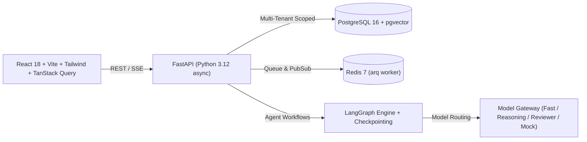

# OpsPilot 🚀

> **AI-native, lightweight business operations SaaS for small IT services and software companies (5–50 employees) who find Odoo too heavy, complex, or expensive to run.**

---

## 🌟 The Pitch: Why OpsPilot vs. Odoo?

| Feature / Need | Odoo ERP | OpsPilot |
| :--- | :--- | :--- |
| **Target Audience** | Enterprise manufacturing, retail, e-commerce, giant orgs | Software agencies, IT consultancies, dev shops, MSPs (5-50 FTE) |
| **Pricing & Complexity** | Expensive per-user licensing, dozens of unused modules | Simple per-organization SaaS pricing with built-in AI agent automation |
| **Quote Generation** | Manual lines, complex multi-step templates | **Lead-to-Proposal AI Agent:** drafts from past similar projects & rate cards |
| **Month-End Billing** | Manual reconciliation of spreadsheets and timesheets | **Month-End Billing Agent:** groups hours, catches rate anomalies & drafts invoices |
| **Odoo Migration** | Months of partner consulting and migration fees | **Migration Center:** 1-day migration via CSV/Excel or JSON-RPC with AI mapping |
| **Human Agency** | Manual buttons everywhere or inflexible automations | **Human-in-the-Loop:** Agents draft; humans approve consequential actions |

---

## 🏗️ Architecture



---

## ⚡ Quickstart

### 1. Run with Docker Compose (Recommended)
```bash
docker compose up -d
```
- **Web UI:** [http://localhost:3000](http://localhost:3000)
- **API Docs (Swagger):** [http://localhost:8000/docs](http://localhost:8000/docs)
- **MinIO Console:** [http://localhost:9001](http://localhost:9001)

### 2. Run Locally in Development Mode

**Backend (Python 3.12):**
```bash
# Setup virtualenv and dependencies
pip install -r backend/requirements.txt

# Apply database migrations & start the server
cd backend
alembic upgrade head
PYTHONPATH=. uvicorn app.main:app --reload --port 8000
```

**Frontend (Node.js 20+):**
```bash
cd frontend
npm install
npm run dev
```

---

## 🧪 Running Tests

OpsPilot includes unit and integration tests across backend and frontend:

```bash
# Run all tests
make test

# Or run backend pytest directly:
PYTHONPATH=backend pytest backend/tests -v

# Run frontend Vitest directly:
cd frontend && npx vitest run
```

---

## 🎬 3-Minute Demo Walkthrough Script

1. **Sign In:** Click **"Owner Demo"** on the login page to immediately log in as Alice Director (Owner of *Northwind Digital*, a 25-person software consultancy).
2. **Review Lead & Auto-Quote:** Head to **CRM & Leads**, view a hot inbound lead (*"Cloud Native Microservices Migration"*), and trigger the **Lead-to-Proposal Agent**. The agent references past similar projects, applies the client's rate card, and drafts a ready-to-send proposal.
3. **Execute Work & Log Time:** Check **Projects & Tasks**, where won deals automatically generate milestones and hourly budgets. In **Timesheets**, view the weekly billable grid.
4. **Month-End Billing Hero Demo:** In **Agent Workflows**, trigger the **Month-End Billing Agent**. It aggregates 540 timesheet hours, applies the rate card, flags an intentional rate mismatch anomaly, and drafts client invoices.
5. **Human Approval:** Navigate to **Approvals Inbox**, inspect the highlighted anomaly with citation evidence, click **Approve**, and generate finalized invoices ready for payment tracking.
