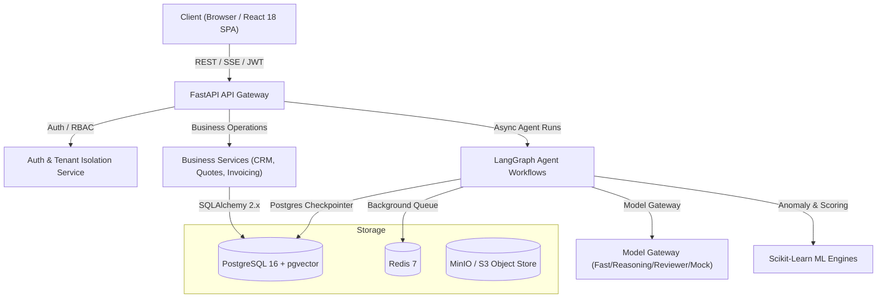

# OpsPilot Architecture Documentation

## System Architecture Overview

## Key Architectural Principles

### 1. Multi-Tenant Row Isolation
Every business record belongs strictly to an Organization via `org_id`. Isolation is enforced systematically at the service layer and validated via automated integration tests (`test_tenant_isolation.py`).

### 2. Monetary Integrity
Monetary values are strictly stored as integer minor units (cents, paise, pence) together with an ISO currency code (`USD`, `EUR`, `INR`, `GBP`). Floating-point arithmetic is strictly prohibited for monetary calculations.

### 3. Agentic Workflows with Human-in-the-Loop
Workflows are modeled as LangGraph state machines:
- **Autonomous Nodes:** Low-risk data aggregation, initial draft creation, anomaly scoring.
- **Interrupt Nodes:** Consequential actions (final invoice dispatch, rate modifications, client communications) pause the state machine and create a pending Approval record.
- **Resume:** Upon human approval via the Approvals Inbox or API, the state machine resumes from its checkpointed state.

### 4. Deterministic Model Gateway & Offline Testing
All LLM operations route through a centralized Model Gateway abstraction that supports:
- Multi-model routing (Fast extraction vs. Deep reasoning vs. Independent reviewer)
- Token and USD cost accounting logged to `model_requests`
- Deterministic mock provider enabled by default (`MOCK_AI_PROVIDER=true`), allowing 100% offline, reproducible testing in CI and local development.
